  

  
  
  
  

<table>
<tr>
<td width="31%" valign="top">
  
</td>
<td width="69%" valign="top">
  
</td>
</tr>
</table>

  

  

  

### `05 / SELECTED REPOSITORIES`

<!-- AUTO:REPOS:START -->

  
  
  
  

<!-- AUTO:REPOS:END -->

  <a href="https://github.com/amirtahanemati?tab=repositories"><b>VIEW ALL REPOSITORIES ↗</b></a>

### `06 / CONNECT`

  
  

  
  

  AMIRTAHA® — Python / FastAPI / Web / Electron.js / Mobile

