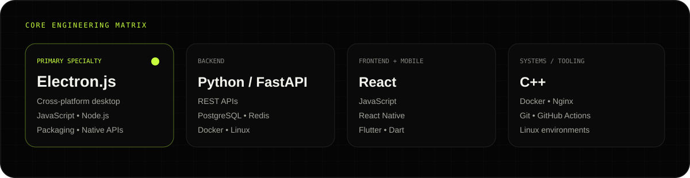
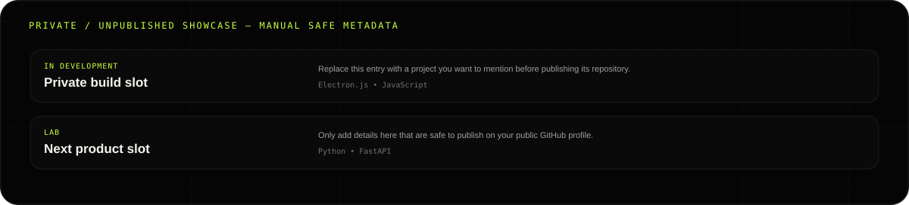

<p align="center">
  
</p>

<p align="center">
  <a href="https://github.com/amirtahanemati"></a>
  <a href="https://www.linkedin.com/in/amirtahanemati/"></a>
  <a href="tel:+989036458812"></a>
  <a href="mailto:amirtahanemati0@gmail.com"></a>
</p>

<br/>

<table>
<tr>
<td width="34%" valign="top">
  
</td>
<td width="66%" valign="top">

### `01 / IDENTITY`

I design and build software that moves from **idea → architecture → interface → deployment**.

My strongest desktop specialty is **Electron.js** — building modern cross-platform desktop products with JavaScript, web technologies and native desktop capabilities.

```text
PRIMARY     Electron.js / JavaScript
BACKEND     Python / FastAPI / APIs
FRONTEND    React / JavaScript
MOBILE      React Native / Flutter
SYSTEMS     C++ / Docker / Linux
```

I care about software that is not only technically correct, but also **fast, usable, maintainable and visually intentional**.

</td>
</tr>
</table>

<p align="center">
  
</p>

## `02 / LIVE GITHUB SIGNAL`

> **This section is generated from GitHub itself.** The numbers, contribution history, languages and repository cards refresh automatically through GitHub Actions.

<p align="center">
  
</p>

### Contribution timeline

<p align="center">
  
</p>

<p align="center"><sub>Rolling 12-month contribution calendar • refreshed automatically</sub></p>

### Coding footprint

<p align="center">
  
</p>

## `03 / ACTIVE REPOSITORIES`

<!-- AUTO:REPOS:START -->
<p align="center"><i>Repository cards will sync on the first GitHub Actions run.</i></p>
<!-- AUTO:REPOS:END -->

<p align="center">
  <a href="https://github.com/amirtahanemati?tab=repositories"><b>EXPLORE ALL REPOSITORIES ↗</b></a>
</p>

## `04 / COMMIT FLOW`

<p align="center">
  
</p>

## `05 / RECENT ENGINEERING ACTIVITY`

<p align="center">
  
</p>

## `06 / LAB — WORK NOT PUBLIC YET`

<p align="center">
  
</p>

> Projects that are not on GitHub cannot be discovered by the GitHub API. Add only the public-safe details you want to reveal to [`data/showcase.json`](./data/showcase.json); the dashboard will render them automatically.

## `07 / CONNECT`

<p align="center">
  <a href="https://www.linkedin.com/in/amirtahanemati/"></a>
  <a href="tel:+989036458812"></a>
</p>
<p align="center">
  <a href="mailto:amirtahanemati0@gmail.com"></a>
  <a href="https://github.com/amirtahanemati"></a>
</p>

<p align="center">
  <sub>AMIRTAHA® / Software engineering with product thinking.</sub>
</p>
