<p align="center">
  
</p>

<p align="center">
  <a href="https://github.com/amirtahanemati"></a>
  <a href="https://www.linkedin.com/in/amirtahanemati/"></a>
  <a href="tel:+989036458812"></a>
  <a href="mailto:amirtahanemati0@gmail.com"></a>
</p>

<table>
<tr>
<td width="34%" valign="top">
  
</td>
<td width="66%" valign="top">

### `01 / IDENTITY`

I mainly build **backend systems and web products** — especially with **Python, FastAPI and modern web development**.

I also work across **desktop** and **mobile** when the product needs it:

```text
MAIN FOCUS   Python / FastAPI / APIs / Web Development
FRONTEND     JavaScript / React
DESKTOP      Electron.js
MOBILE       React Native / Flutter
SYSTEMS      C++ / Docker / Linux
```

I like software that is **clean, practical, fast and product-oriented**.

</td>
</tr>
</table>

<p align="center">
  
</p>

## `02 / LIVE GITHUB SIGNAL`

> Live data from GitHub. Kept intentionally short and useful.

<p align="center">
  
</p>

## `03 / COMMIT SNAKE`

<p align="center">
  
</p>

## `04 / ACTIVE REPOSITORIES`

<!-- AUTO:REPOS:START -->
<p align="center">
  <a href="https://github.com/amirtahanemati/menu-cafe-react"></a>
  <a href="https://github.com/amirtahanemati/React-Tailwind-CSS"></a>
  <a href="https://github.com/amirtahanemati/Color-palette-extractor"></a>
  <a href="https://github.com/amirtahanemati/Dictionary-app"></a>
  <a href="https://github.com/amirtahanemati/APL-Final-Project"></a>
</p>
<!-- AUTO:REPOS:END -->

<p align="center">
  <a href="https://github.com/amirtahanemati?tab=repositories"><b>EXPLORE ALL REPOSITORIES ↗</b></a>
</p>

## `05 / CONNECT`

<p align="center">
  <a href="https://www.linkedin.com/in/amirtahanemati/"></a>
  <a href="tel:+989036458812"></a>
</p>
<p align="center">
  <a href="mailto:amirtahanemati0@gmail.com"></a>
  <a href="https://github.com/amirtahanemati"></a>
</p>

<p align="center">
  <sub>AMIRTAHA® / Backend, APIs, web, desktop and mobile.</sub>
</p>
